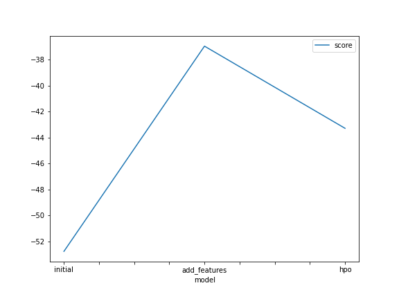
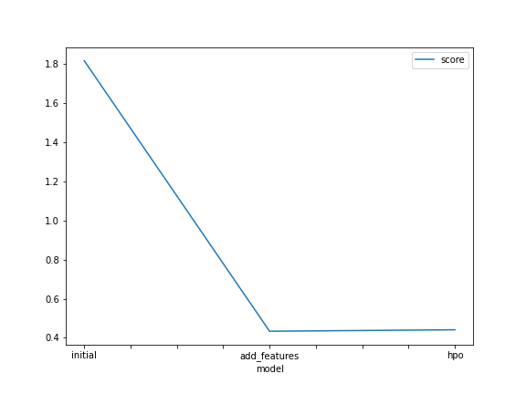

# Report: Predict Bike Sharing Demand with AutoGluon Solution
#### Mohanad Ahmed

## Initial Training

The accuracy score was very bad at the intitial training so I traied to doing exploratory data analysis and I've traied many methods, at first a I changed the dtype of some columns to category then I've traied to remove columns that has les correlation with the output

### The top ranked model that performed?
The top ranked model was the second one (add_features) with score 0.43404

## Exploratory data analysis and feature creation
### What did the exploratory analysis find and how did you add additional features?
I found that there is categoy columns there dtype is int and there is a column that contain date and time combined so I extracted the year, month, day, and hour into a separte coulmns

### How much better did your model perform after adding new features and why do you think that is?
It performs much better than the initial one, I think the reason is it's easy for the model to take informations from the extracted features that the combined date-time column, also i think its performs well due to the change in the data type.

## Hyper parameter tuning
### How much better did your model preform after trying different hyper parameters?
Actually there was a small lettle defferance in the score and I 've traied many different hyper parameters

### If you were given more time with this dataset, where do you think you would spend more time?
I'll spend more type in data engineering and preprocessing 

### Create a table with the models you ran, the hyperparameters modified, and the kaggle score.
  model : initial_model      add_features_model    hpo_model
  
  hpo1  : default_vals           default_vals      GBM: num_leaves: lower = 6, upper = 100
  
  hpo2  : default_vals           default_vals      NN: dropout_prob: 0.0, 0.5
  
  hpo3  : default_vals           default_vals      CAT: depth: lower = 6, upper = 100
  
  score :   1.81241                0.43404           0.44147

### Create a line plot showing the top kaggle score for the three (or more) prediction submissions during the project.

## Summary

I've started with the initial hyperparameters and data without any change 
Then I've tried again after applying feature engineering such as adding new features and change the data type of some columns to category to be easer to the model to fit the data
I've tried hyperparameter tuning but the accuracy change with a little bet but it didn't improve, I think the reason is at normal state we choose best quality so autogloun automatically searching for the best hyperparameters that fits the validation data with the best accuracy